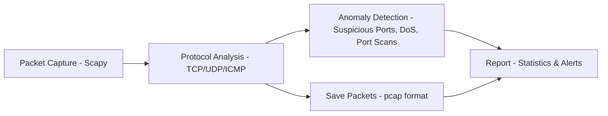

# 📡 Network Packet Analyzer (Mini Wireshark Clone)

## 📌 Project Overview
This project implements a lightweight **network packet analyzer** using Python and the **Scapy** library.  
It demonstrates **packet sniffing, protocol analysis, and anomaly detection** in a simplified manner, inspired by Wireshark.

⚠️ **Disclaimer**: This tool is intended for **educational purposes only**.  
Do not use it for unauthorized packet sniffing or in production environments.

---

## ✨ Key Features
- Capture live network packets from a selected network interface
- Protocol classification:
  - TCP (with port analysis)
  - UDP
  - ICMP
- Save traffic to `.pcap` format (openable in Wireshark)
- Protocol statistics summary (counts of TCP, UDP, ICMP packets)
- Anomaly detection:
  - Suspicious TCP port usage (e.g., port `4444`)
  - **DoS-like traffic detection** (20+ connections in 5s)
  - **Port scan detection** (10+ ports in 10s)

---

## 🛠 Skills Demonstrated
- Applied **network security concepts**
- **Packet sniffing** and traffic monitoring
- **Protocol analysis** (TCP, UDP, ICMP)
- Basic anomaly detection
- Python programming with **Scapy**
- Cross-platform coding (Linux + Windows)

---

## 📦 Requirements
- Python 3.x
- `scapy` library
- `psutil` (for friendly interface names)

Install dependencies:
```bash
pip install -r requirements.txt
```

---

## 🏗️ Architecture Diagram



---

## 🚀 Usage

### Linux / macOS

1) **Clone and enter the project folder**
```bash
git clone https://github.com/taniafatmawati/network-packet-analyzer.git
cd network-packet-analyzer
```

2) **Create a virtual environment & install dependencies**
```bash
python3 -m venv venv
source venv/bin/activate
pip install -r requirements.txt
```

3) **Run the analyzer (requires root privileges)**
Make sure to use the Python interpreter from your virtual environment:
```bash
sudo -E ./venv/bin/python analyzer.py
```

### Windows Setup & Usage

1) **Install Npcap**
- Download: [Npcap](https://npcap.com/)  
- Enable **“WinPcap API-compatible mode”** during installation
- Restart after installation

2) **Clone and enter the project folder**
```powershell
git clone https://github.com/yourusername/network-packet-analyzer.git
cd network-packet-analyzer
```

3) **Create a virtual environment & install dependencies**
```powershell
python -m venv venv
.\venv\Scripts\Activate.ps1
pip install -r requirements.txt
```

If PowerShell blocks the script, run:
```powershell
Set-ExecutionPolicy -Scope Process -ExecutionPolicy Bypass
.\venv\Scripts\Activate.ps1
```

(Alternative via CMD:)
```cmd
venv\Scripts\activate.bat
```

4) **Run Analyzer**
Option A – Manual:
```powershell
python analyzer.py
```

Option B – Batch file (recommended):
Right click `run-windows.bat` → **Run as Administrator**

**Stop the capture**
- Press **Ctrl+C** in the terminal
- Results will automatically be saved to capture.pcap

📌 Tip: Open the `capture.pcap` file in **Wireshark** for further analysis.

---

## 🎬 Demo (Loopback)

This demo uses **interface 0 (loopback, 127.0.0.1)** so anyone can reproduce it locally without affecting networks.


### How to Run (Step-by-Step)

#### Terminal A — Analyzer

Start the analyzer and choose interface `0`:

```bash
sudo -E ./venv/bin/python analyzer.py
# When prompted, type: 0
````

#### Terminal B — Demo Script

Run a prepared demo sequence to generate TCP/UDP/ICMP traffic and trigger anomaly detection:

```bash
chmod +x demo-loopback.sh
./demo-loopback.sh
```

The script runs:
- TCP test (curl) — optional external request
- UDP test — send a UDP packet to localhost (port 9999)
- ICMP test — ping 127.0.0.1
- Suspicious port test — attempt to connect to port 4444, then start a listener and connect successfully
- Port scan test — scan ports 1–20 (nmap or nc fallback)
- Controlled many-connects to try to trigger port-scan/DoS alerts

Watch Terminal A — you will see live packet logs, alerts for suspicious ports, port scans, and DoS-like traffic.

Stop the analyzer with **Ctrl+C**. Results are automatically saved to `capture.pcap`.

Inspect the pcap:

```bash
ls -l capture.pcap
# Optional: view summary (requires tshark)
tshark -r capture.pcap -q -z io,phs
# Or copy to your local machine for Wireshark
scp user@server:/path/to/network-packet-analyzer/capture.pcap ~/Downloads/
```

> ⚠️ Note: `capture.pcap` is **not included** in the repository. Generate it safely using the demo script.

📸 Example Screenshot:


---

### Notes

* The demo script is **loopback-only** and safe.
* For a realistic network demo, capture on your LAN interface and run tests from a different host.
* Ensure `nmap` and `nc` are installed for full test coverage:

```bash
sudo dnf install -y nmap ncat
```

---

## 🔮 Future Improvements
- Add real-time visualization (graphs/charts for traffic)
- Build GUI dashboard
- Extend anomaly detection with ML models

---
